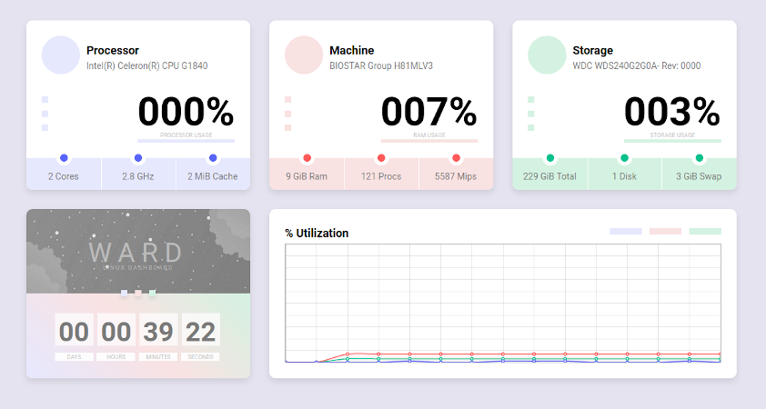

<h2 align = "center">
  
</h2>

  

  <a href = "http://b-server.org/">DEMO</a>

## Overview
* **Simple and minimalistic design**
* **Less than 1MB weight**
* **Drop-in installation**

## Features
As it is minimalistic dashboard, it shows only principal info, without any details

* **Processor**
    * CPU name
    * CPU usage
    * CPU(s) count
    * Max CPU frequency
    * L3 cache amount

* **Machine**
    * Machine name
    * RAM usage
    * RAM amount in gibibytes
    * Processes count
    * CPU bogomips

* **Storage**
    * Host0 starage name
    * Storage usage
    * Storage amount in gibibytes
    * Disks count
    * Swap amount in gibibytes

## Installation
1. Make sure you have the `shell_exec`function enabled
2. Drop files in to your web server folder
