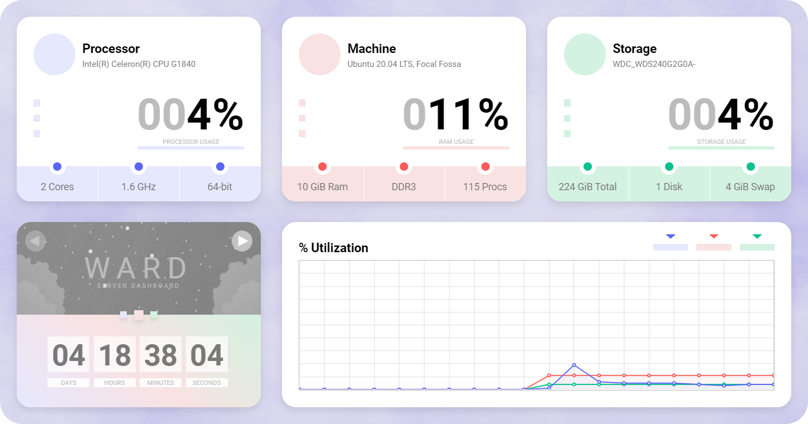

<h3 align = "center">


</h3>
<h3 align = "center">
    
</h3>

---

## [Demo](https://status.leons.dev)

# Quick start

## Docker

* `docker run --restart unless-stopped -it -d --name ward  -p 4000:4000 -e WARD_PORT=4000 -e WARD_THEME=dark --privileged antonyleons/ward`
* Go to localhost:4000 in web browser

Also see the example [docker-compose.yml](https://github.com/AntonyLeons/Ward/blob/main/docker-compose.yml) file in the root directory.

## Java

Download the latest release from [here](https://github.com/AntonyLeons/Ward/releases/latest)

```console
java -jar ward.jar
```

### About

Ward is a simple and minimalistic server monitoring tool. Ward supports adaptive design system. Also, it supports dark theme.
It shows only principal information and can be used, if you want to see nice looking dashboard instead looking on bunch of numbers and graphs.
Ward works nice on all popular operating systems, because it uses [OSHI](https://github.com/oshi/oshi).

**All features tested on:** `Windows` `Linux`

<p align = "center">
    
    <h6 align = "center">Preview Image</h6>
</p>

---

### Installation

    Create your own jar

    • Clone the project
    • Import project in your IDE as Maven project
    • mvn clean package

<br>

    Run jar file

    1. Create you own jar as described above
    2. Execute jar on Windows or Linux with administrative rights
    3. Enter localhost:4000 and set up application

<br>

    Build for Docker

    1. Clone the project
    2. docker build --tag ward
    3. docker run --restart unless-stopped -it -d --name ward  -p 4000:4000 -e WARD_PORT=4000 -e WARD_THEME=dark --privileged ward
    4. Go to localhost:4000 in web browser

### Config

If you want to change Ward's configuration, you can edit `setup.ini`. When using Docker, use the environment variables `WARD_NAME`,`WARD_THEME`, `WARD_PORT` to automatically regenerate this file at startup. Using any environment variable listed will enable the defaults below and immediately start Ward without the GUI setup. 

| Setting    | Description                  | Default |
|------------|------------------------------|---------|
| serverName | Name shown in the interface. | Ward    |
| theme      | Either `light` or `dark`.    | light   |
| port       | Port to listen on.           | 4000    |

Environment variables take priority and will regenerate this file with your variables. If no environment variables are set, `setup.ini` is generated once you navigate to Ward's webpage and complete the initial setup. You can also make this file yourself before starting Ward, and place it in the same directory.

For example:

```ini
[setup]
serverName = my-server
theme = dark
port = 8200
```
